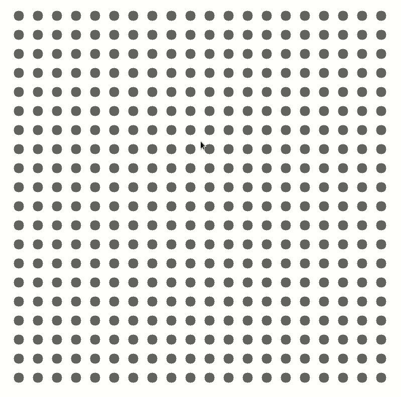
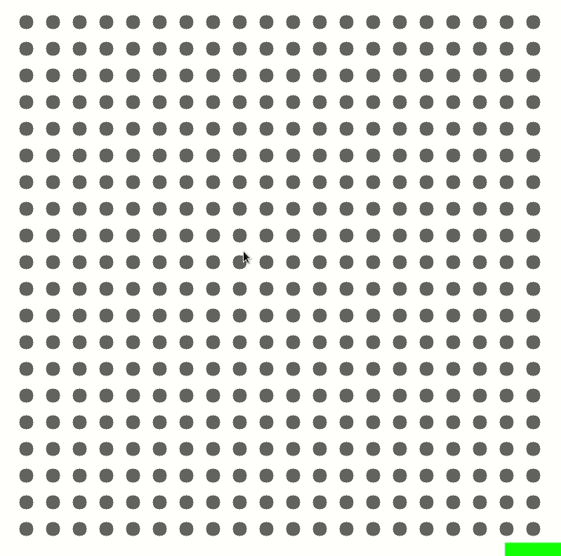
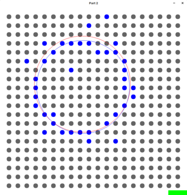

# Digitized Circles #
*by Robert Kuramshin*

## Installation ##
- install [python](https://www.python.org/download/releases/)
- install dependencies `pip install -r requirements.txt`
- run using `python part1.py` or `ptyhon part2.py`

## Part 1 ##
Usage:
- Click at the desired center of circe and drag to change size
- Release mouse button to set circle size
- To create a new circle simply click anywhere on the screen again
- To exit press escape

Visuals Explanation:
- Blue circle signifies the bounds of the drawn circle
- Grid circles will be highlighted blue as a digitized representation of the blue circle
- Two red circles will show maximum and minimum circles formed by the selected blue circles

Algorithms:  
`biggest_radius` - The biggest circle formed by the points is selected by iteratively attempting to create circles with a larger radius until any of the previously overllaped points are not longer interesected.   
`smallest_radius` - A similar algorithm to the biggest circle is implemented here. Instead of incrementing the circle radius, the radius is decreased until the circle fails to intersect the same points.
`circle_intersects` - To determine which grid circle will interesect the user selected circle I compared the distance between the circles to their radii.

## Part 2 ##
Usage:
- Click any grid circle to select it (it will change color from gray to blue)
- Once desired circles are selected, click the gray box in the bottom right color to generate circle
- A blue circle will appear that will attempt to fit the selected points

Visuals Explanation:
- Blue grid circles are selected, gray are not selected
- The blue circle will represent the attempt to draw a circle that best fits the selected points
- A red circle will show the initial guess used for minimization function
- To exit press escape

Algorithms:  
`error_fun` - Linear minimization is used to find the circle that best fits the selected grid circles. An initial guess is formed by finding centroid and average distance to all points. Nelder-Mead minimization function then attempts to find a circle center and radius that minimizes the error function. The error function is defined as the number of selected gridcircles not intersected by generate circle.  

## Examples ##
# #

# #

# #

## Discussion ##
Linear minimization tends to perform well in situations where selected points are symmetrical. In these situations the starting guess is usually already fairly good, but the function almost always is able to find a circle that intersects more grid circles. This is epsecially noticable with roughly symmetrical examples with a large number of points.
  
  
Grid circles overlapped by initial guess: 12  
Grid circles overlapped by minimized circle: 16  

If the initial guess is poor, or the grid circles selected are no well behaved, then the minimization might not find a significantly better solution than the initial guess.  

  
Grid circles overlapped by initial guess: 1  
Grid circles overlapped by minimized circle: 3